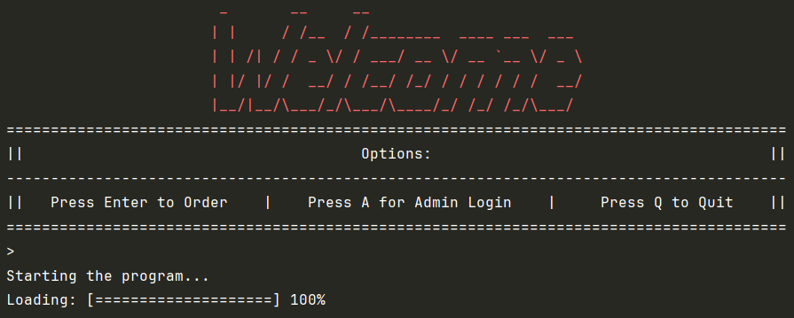

<h1 align="center">Knuckles Sandwiches 🥪</h1>

<div align="center">
  
</div>


<div align="center">
  
## Table of Contents:
 * [Project Description:](#project-description)
 * [Features:](#features)
 * [Interesting Code Snippet:](#interesting-code-snippet)
 * [Installation:](#installation)
 * [Usage:](#usage)
 * [License:](#license) 
</div>


---

<div align="center">

### Home Page:


### Sandwich Builder:


### Order Receipt:


</div>


---

## Project Description:

Knuckles Sandwiches is a Java application that allows users to browse, customize, and order delicious sandwiches through a CLI app. Built with Java, it demonstrates clean code practices, user input validation, and object-oriented design. Perfect for learning core Java concepts through a fun, food-ordering system!


---

## Features:

- 🍞 Create custom sandwiches with a variety of breads, meats, and toppings
- 🛒 Shopping cart functionality
- 🧾 Receipt printing and saving

---


## Interesting Code Snippet:


```java
private static String prompt(String message, List<String> validOptions) {
        while (true) {
            System.out.println(message);
            System.out.print("> ");
            String input = HomeScreen.read.nextLine().trim();

            // Case-insensitive comparison
            for (String option : validOptions) {
                if (option.equalsIgnoreCase(input)) {
                    return option; // Return the properly cased version
                }
            }

            // For numeric menu options (like "1", "2")
            try {
                int num = Integer.parseInt(input);
                if (num > 0 && num <= validOptions.size()) {
                    return validOptions.get(num - 1);
                }
            } catch (NumberFormatException ignored) {
            }

            System.out.println("Invalid option. Please choose from: " + validOptions);
        }
    }
```
Purpose: This helper method prompts the user for input and validates it against a list of acceptable options.

Key Features: Displays a message and waits for user input

Accepts input in two ways:

Direct text match (case-insensitive)

Numeric selection (e.g., entering "1" for the first option)

Loops continuously until valid input is received

Validation Logic:

First checks for exact (case-insensitive) text matches

Then tries to parse numbers as menu indices

Shows the valid options if input is invalid

## Installation:

To run Knuckles Sandwiches locally:

 Clone the repository:
```bash
git clone https://github.com/Gagucci/KnucklesSandwiches.git
cd KnucklesSandwiches
```

 Open with Intellij

 Run the application using Maven


## Usage:

- Browse the menu or create a custom sandwich
- Add items to your cart
- Proceed to checkout
- Print your receipt


## License:

<div align="center">

[](https://opensource.org/licenses/MIT)

</div>
